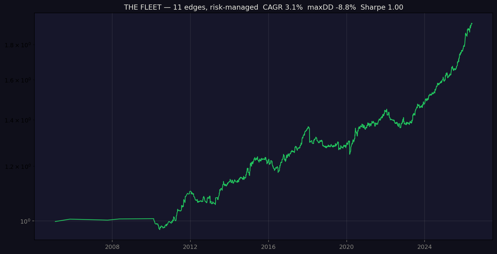

# Multi-Edge Algorithmic Trading System

> A validated, risk-managed portfolio of uncorrelated trading edges across FX, equity
> indices, metals, and energy — built and stress-tested over 21 years (2004–2026) with
> out-of-sample rigor, and engineered to a fundable single-digit drawdown.

This project began as a single volume-profile strategy on EURUSD and grew, through
disciplined research, into an **11-edge portfolio** combining trend-following and
mean-reversion across four asset classes. Every edge earned its place by passing an
out-of-sample robustness gauntlet — and **every dead end is documented too**, because
honest research is the point.

---

## Results — combined portfolio (risk-managed, 21 years)



| Metric | Value |
|--------|-------|
| Annualised return (CAGR) | **3.1%** at the fundable risk setting |
| Maximum drawdown | **8.8%** |
| Sharpe ratio | **1.00** |
| Trades per year | **~124** |
| Profit factor | **1.33** |
| Period | 2004–2026 (21 years, walk-forward) |

The return is **deliberately modest at this setting** — the portfolio is vol-targeted to a
~9% drawdown so it fits prop-firm risk limits. Returns are percentage-based and identical
at any account size; the system is designed to be **consistent and scalable**, not to
gamble a small account. All results are **net of realistic costs** (spreads, slippage, and
exchange fees per instrument).

---

## Why this is trustworthy (the method)

Most strategy repos show only what worked. This one shows the **process** — which is what
separates a real edge from an overfit backtest:

**Every candidate strategy is run through a robustness gauntlet before it is trusted:**
1. **Out-of-sample** — history is split in two; the edge must work in *both* halves
   (kills small-sample flukes and decayed edges).
2. **Parameter stability** — profit factor across a grid of settings; a real edge is a
   *plateau*, an overfit one a lonely spike.
3. **Recent-years** — is it still alive, or did it die after its golden era?

**The gauntlet rejected more than it passed**, and those rejections are recorded in
[`docs/THE_FLEET.md`](docs/THE_FLEET.md): multi-pair forex, intraday volume profile, crypto
strategies, BTC/ETH momentum (decayed post-2021), the S&P/Dow on momentum, gold/silver
stat-arb, and more. Documenting failures honestly is the trust signal.

---

## The validated edges

**Mean-reversion sleeve** (pays in ranging / choppy markets):

| Edge | Market | Method | PF |
|------|--------|--------|----|
| EURUSD | forex | volume-profile reversion in neutral regime | 1.93 |
| S&P 500 | index | RSI(2) dip-buy in uptrend | 1.98 |
| Nasdaq 100 | index | RSI(2) dip-buy in uptrend | 1.76 |
| Dow 30 | index | RSI(2) dip-buy in uptrend | 1.36 |
| Cross-sectional FX | 28-pair G8 basket | market-neutral relative-value reversion | 1.25 |

**Momentum sleeve** (pays in trends) — Donchian breakout + ATR trailing stop:

| Edge | Market | PF |
|------|--------|----|
| DAX, Nikkei, Nasdaq (long-only) | indices | 1.32–1.42 |
| Brent crude | energy | 1.21 |
| Gold, Silver | metals | 1.17–1.18 |

The two sleeves make money in **opposite conditions** (trends vs chop), and the
cross-sectional FX edge is **market-neutral** — together they smooth the equity curve.

---

## Risk management

The combiner is not a naive sum of strategies. It applies a real risk layer:
- **Volatility parity** — each edge scaled to equal risk so none dominates.
- **Per-sleeve budgeting** — correlated instruments (e.g. the 6 momentum markets) share one
  risk budget, so a single regime can't drive the portfolio drawdown.
- **De-risk in drawdown** — position size is cut automatically when the portfolio is bleeding.
- **Volatility targeting** — overall risk dialed to a chosen maximum drawdown (default ~10%).

These took the raw combined drawdown from −29% to **−8.8%** at the same Sharpe.

---

## Honest limitations

- **Sharpe ~1.0** is the realistic ceiling for this instrument universe; more edges give
  diminishing returns. Income scales with **funded capital**, not by over-leveraging.
- A few months of live results would be **noise** — the edge is statistical over years.
- The momentum sleeve carries some long-equity/bull-market tailwind; the risk layer and the
  market-neutral sleeve mitigate but do not eliminate crash exposure.

---

## How it works / reproduce

Data is sourced from Dukascopy (candles with real volume) into a local DuckDB store, then
all backtests run **offline** for speed and determinism. Data is gitignored (too large) —
rebuild it with the download script.

```bash
python3 -m venv venv && source venv/bin/activate
pip install -r requirements.txt

# rebuild the data (Node.js required for dukascopy-node)
python scripts/download_dukascopy.py --majors --from 2004-01-01

# the combined risk-managed portfolio + equity curve
python scripts/portfolio.py --target-dd 0.10 --capital 5000
```

### Project structure

```
scripts/
  download_dukascopy.py     data ingest (candles + real volume → DuckDB)
  proto_momentum.py         trend-following (Donchian + ATR trail)
  proto_reversion_idx.py    index mean-reversion (RSI-2 dip-buy)
  proto_reversion_fx.py     FX mean-reversion
  proto_xsectional.py       cross-sectional / market-neutral
  robustness_momentum.py    the gauntlet (out-of-sample / param grid)
  screen_momentum.py        fleet screeners (rank many instruments)
  screen_reversion.py
  portfolio.py              combine all edges → risk-managed equity curve
src/                        EURUSD volume-profile engine + MT5/offline data providers
docs/
  THE_FLEET.md              full edge breakdown + every rejected experiment
  STRATEGY_NOTES.md         the original EURUSD model's findings
  DEPLOYMENT.md             the roadmap from backtest → funded live trading
```

---

## Status & roadmap

The research phase is **complete**: a validated, risk-managed, fundable system. The next
phase is **deployment and funding** — see **[`docs/DEPLOYMENT.md`](docs/DEPLOYMENT.md)** for
the concrete steps from backtest to a funded live account.

**Documentation:** [The Fleet](docs/THE_FLEET.md) · [Strategy Notes](docs/STRATEGY_NOTES.md) · [Deployment](docs/DEPLOYMENT.md)

*Developed on macOS · Python 3.13 · DuckDB · designed for live execution via MetaTrader 5.*
